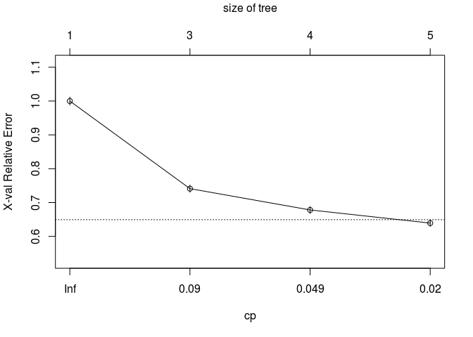
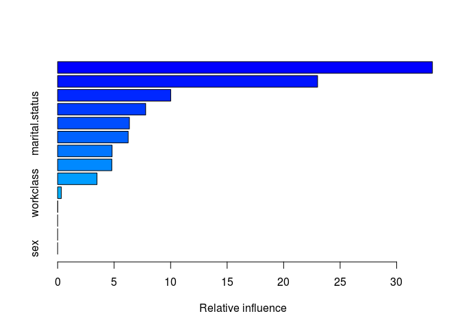

ML income prediction
================

ML Parameter tuning
-------------------

I got the dataset from [UCI Machine learning repository](https://archive.ics.uci.edu/ml/datasets/adult). The dataset has 32561 observations and 15 variables. The goal variable is `over50K`, a binary variable which indicates if person's yearly income is over 50K$ or not. So this is a classification problem. I tried to predict the goal variable with 4 different ML algorithms. I also tried to improve the models by tuning the hyperparametes of the models. For evaluating the performance of the models I calculated AUC scores for each.

Decision Tree
-------------

First I used a simple decision tree. I tried to use pruning to cut back the tree, but it turns out that the fully grown tree has the lowest cross-validated error so pruning is not needed.

``` r
# Creating a train-test-split
set.seed(1234)
train <- sample(nrow(data), 0.7*nrow(data))
data.train <- data[train,]
data.test <- data[-train,]


# Creating the model
income_model <- rpart(formula = over50K ~ ., 
                      data = data.train, 
                      method = "class")

print(income_model)
```

    ## n= 22792 
    ## 
    ## node), split, n, loss, yval, (yprob)
    ##       * denotes terminal node
    ## 
    ##  1) root 22792 5543  <=50K (0.75680063 0.24319937)  
    ##    2) relationship= Not-in-family, Other-relative, Own-child, Unmarried 12500  844  <=50K (0.93248000 0.06752000)  
    ##      4) capital.gain< 7073.5 12289  644  <=50K (0.94759541 0.05240459) *
    ##      5) capital.gain>=7073.5 211   11  >50K (0.05213270 0.94786730) *
    ##    3) relationship= Husband, Wife 10292 4699  <=50K (0.54343179 0.45656821)  
    ##      6) education= 10th, 11th, 12th, 1st-4th, 5th-6th, 7th-8th, 9th, Assoc-acdm, Assoc-voc, HS-grad, Preschool, Some-college 7200 2432  <=50K (0.66222222 0.33777778)  
    ##       12) capital.gain< 5095.5 6833 2073  <=50K (0.69661935 0.30338065) *
    ##       13) capital.gain>=5095.5 367    8  >50K (0.02179837 0.97820163) *
    ##      7) education= Bachelors, Doctorate, Masters, Prof-school 3092  825  >50K (0.26681759 0.73318241) *

``` r
# Results
rpart.plot(x = income_model)
```


``` r
# Generating predicted classes
class_prediction <- predict(object = income_model,  
                            newdata = data.test,   
                            type = "class")  

# Calculating confusion matrix 
confusionMatrix(data = class_prediction,       
                reference = data.test$over50K) 
```

    ## Confusion Matrix and Statistics
    ## 
    ##           Reference
    ## Prediction  <=50K  >50K
    ##      <=50K   7068  1099
    ##      >50K     403  1199
    ##                                           
    ##                Accuracy : 0.8462          
    ##                  95% CI : (0.8389, 0.8533)
    ##     No Information Rate : 0.7648          
    ##     P-Value [Acc > NIR] : < 2.2e-16       
    ##                                           
    ##                   Kappa : 0.5226          
    ##  Mcnemar's Test P-Value : < 2.2e-16       
    ##                                           
    ##             Sensitivity : 0.9461          
    ##             Specificity : 0.5218          
    ##          Pos Pred Value : 0.8654          
    ##          Neg Pred Value : 0.7484          
    ##              Prevalence : 0.7648          
    ##          Detection Rate : 0.7235          
    ##    Detection Prevalence : 0.8360          
    ##       Balanced Accuracy : 0.7339          
    ##                                           
    ##        'Positive' Class :  <=50K          
    ## 

``` r
# Accuracy
dt_acc <- sum(class_prediction == data.test$over50K)/nrow(data.test)
```

Next I tried creating a gini-model and information-model by changing the `type` parameter. This changes how the algorithm chooses the variable that is used to split the set of items. There seems to be no difference between the models.

I then tried to improve the original model by pruning.

``` r
# Training an gini-based model
income_model1 <- rpart(formula = over50K ~ ., 
                       data = data.train, 
                       method = "class",
                       parms = list(split = "gini"))

# Training an information-based model
income_model2 <- rpart(formula = over50K ~ ., 
                       data = data.train, 
                       method = "class",
                       parms = list(split = "information"))

# Generating predictions on the validation set using the gini model
pred1 <- predict(object = income_model1, 
                 newdata = data.test,
                 type = "class")    

# Generating predictions on the validation set using the information model
pred2 <- predict(object = income_model2, 
                 newdata = data.test,
                 type = "class")

# Comparing classification error
ce(actual = data.test$over50K, 
   predicted = pred1)
```

    ## [1] 0.1537517

``` r
ce(actual = data.test$over50K, 
   predicted = pred2)
```

    ## [1] 0.1537517

``` r
plotcp(income_model)
```



``` r
print(income_model$cptable)
```

    ##           CP nsplit rel error    xerror       xstd
    ## 1 0.13007397      0 1.0000000 1.0000000 0.01168472
    ## 2 0.06332311      2 0.7398521 0.7634855 0.01059073
    ## 3 0.03409706      3 0.6765290 0.7252390 0.01038083
    ## 4 0.01000000      4 0.6424319 0.6509111 0.00994184

``` r
# Retrieving optimal cp value based on cross-validated error
opt_index <- which.min(income_model$cptable[, "xerror"])
cp_opt <- income_model$cptable[opt_index, "CP"]

# Pruning the model (to optimized cp value)
income_model_opt <- prune(tree = income_model, 
                         cp = cp_opt)

# Plotting the optimized model
rpart.plot(x = income_model_opt, yesno = 2)
```


``` r
# Generating predicted classes using the model object
class_prediction <- predict(object = income_model_opt,  
                            newdata = data.test,   
                            type = "class")  

# Calculating the confusion matrix for the test set
confusionMatrix(data = class_prediction,       
                reference = data.test$over50K) 
```

    ## Confusion Matrix and Statistics
    ## 
    ##           Reference
    ## Prediction  <=50K  >50K
    ##      <=50K   7068  1099
    ##      >50K     403  1199
    ##                                           
    ##                Accuracy : 0.8462          
    ##                  95% CI : (0.8389, 0.8533)
    ##     No Information Rate : 0.7648          
    ##     P-Value [Acc > NIR] : < 2.2e-16       
    ##                                           
    ##                   Kappa : 0.5226          
    ##  Mcnemar's Test P-Value : < 2.2e-16       
    ##                                           
    ##             Sensitivity : 0.9461          
    ##             Specificity : 0.5218          
    ##          Pos Pred Value : 0.8654          
    ##          Neg Pred Value : 0.7484          
    ##              Prevalence : 0.7648          
    ##          Detection Rate : 0.7235          
    ##    Detection Prevalence : 0.8360          
    ##       Balanced Accuracy : 0.7339          
    ##                                           
    ##        'Positive' Class :  <=50K          
    ## 

``` r
dt_acc <- sum(class_prediction == data.test$over50K)/nrow(data.test)


# Generating predictions on the test set
pred <- predict(object = income_model_opt,
                newdata = data.test,
                type = "prob")

# Generating predictions on the validation set using the gini model
pred1 <- predict(object = income_model1, 
                 newdata = data.test,
                 type = "prob")    

# Generating predictions on the validation set using the information model
pred2 <- predict(object = income_model2, 
                 newdata = data.test,
                 type = "prob")


# Computing the AUC (`actual` must be a binary (or 1/0 numeric) vector)
auc(actual = ifelse(data.test$over50K == " >50K", 1, 0), 
    predicted = pred[,2]) 
```

    ## [1] 0.8488216

``` r
auc(actual = ifelse(data.test$over50K == " >50K", 1, 0), 
    predicted = pred1[,2]) 
```

    ## [1] 0.8488216

``` r
auc(actual = ifelse(data.test$over50K == " >50K", 1, 0), 
    predicted = pred2[,2]) 
```

    ## [1] 0.8488216

``` r
dt_preds <- pred[,2]
```

Bagging
-------

Next I tried bagging. Bagging (= bootstrap aggregating) is method which is designed to improve the accuracy of machine learning algorithms. Basically what bagging does is that samples are taken from the original train data(with replacement) and models are fitted to each of the samples. The output of the models are then averaged. Interestingly, in this case, the accuracy wasn't improved by bagging.

``` r
# Specifying the training configuration
ctrl <- trainControl(method = "cv",     # Cross-validation
                     number = 5,      # 5 folds
                     classProbs = TRUE,                  # For AUC
                     summaryFunction = twoClassSummary)  # For AUC

# Cross validating the income model using "treebag" method; 
# Track AUC (Area under the ROC curve)
set.seed(1234)  
str(data.train)
```

    ## 'data.frame':    22792 obs. of  15 variables:
    ##  $ age           : int  26 44 43 22 30 36 41 36 48 45 ...
    ##  $ workclass     : Factor w/ 9 levels " ?"," Federal-gov",..: 5 5 5 5 5 5 6 5 5 5 ...
    ##  $ fnlwgt        : int  290286 185798 160246 137862 241885 220696 34987 213008 268234 1366120 ...
    ##  $ education     : Factor w/ 16 levels " 10th"," 11th",..: 12 9 16 16 16 12 16 12 12 9 ...
    ##  $ education.num : int  9 11 10 10 10 9 10 9 9 11 ...
    ##  $ marital.status: Factor w/ 7 levels " Divorced"," Married-AF-spouse",..: 5 6 1 5 3 1 3 1 1 1 ...
    ##  $ occupation    : Factor w/ 15 levels " ?"," Adm-clerical",..: 4 4 11 2 6 8 6 6 4 9 ...
    ##  $ relationship  : Factor w/ 6 levels " Husband"," Not-in-family",..: 2 3 5 3 1 2 1 2 2 2 ...
    ##  $ race          : Factor w/ 5 levels " Amer-Indian-Eskimo",..: 3 5 3 5 5 5 5 5 5 5 ...
    ##  $ sex           : Factor w/ 2 levels " Female"," Male": 2 2 1 1 2 2 2 2 2 1 ...
    ##  $ capital.gain  : int  0 0 0 0 0 0 0 0 0 0 ...
    ##  $ capital.loss  : int  0 0 0 0 0 0 0 0 0 0 ...
    ##  $ hours.per.week: int  40 48 40 16 40 40 54 40 50 8 ...
    ##  $ native.country: Factor w/ 42 levels " ?"," Cambodia",..: 40 40 40 40 40 40 40 40 40 40 ...
    ##  $ over50K       : Factor w/ 2 levels " <=50K"," >50K": 1 2 1 1 1 1 2 1 1 1 ...

``` r
levels(data.train$over50K)[1] <- "under50K"
levels(data.train$over50K)[2] <- "over50K"
income_caret_model <- train(over50K ~ .,
                            data = head(data.train, 100), 
                            method = "treebag",
                            metric = "ROC",
                            trControl = ctrl)

print(income_caret_model)
```

    ## Bagged CART 
    ## 
    ## 100 samples
    ##  14 predictors
    ##   2 classes: 'under50K', 'over50K' 
    ## 
    ## No pre-processing
    ## Resampling: Cross-Validated (5 fold) 
    ## Summary of sample sizes: 81, 80, 79, 79, 81 
    ## Resampling results:
    ## 
    ##   ROC        Sens       Spec     
    ##   0.7452206  0.9279412  0.2666667

``` r
# Print the CV AUC
income_caret_model$results[,"ROC"]
```

    ## [1] 0.7452206

``` r
# Generate predictions on the test set
pred <- predict(object = income_caret_model, 
                newdata = data.test,
                type = "prob")

bag_preds <- pred[,2]

# Compute the AUC (`actual` must be a binary (or 1/0 numeric) vector)
auc(actual = ifelse(data.test$over50K == " >50K", 1, 0), 
    predicted = pred[,"over50K"])
```

    ## [1] 0.8217895

Random Forest
-------------

Next I created a Random Forest model. I changed the `ntree` parameter from 500(=default) to 250. Then I used the `tuneRF` function to tune the `mtry` parameter. The optimal parameter value was chosen based on the OOB error and model with the optimal value was created.

``` r
library(randomForest)
set.seed(1234)  
income_model <- randomForest(formula = over50K ~ ., 
                             data = data.train)

print(income_model)
```

    ## 
    ## Call:
    ##  randomForest(formula = over50K ~ ., data = data.train) 
    ##                Type of random forest: classification
    ##                      Number of trees: 500
    ## No. of variables tried at each split: 3
    ## 
    ##         OOB estimate of  error rate: 13.81%
    ## Confusion matrix:
    ##          under50K over50K class.error
    ## under50K    16073    1176  0.06817787
    ## over50K      1972    3571  0.35576403

``` r
print(importance(income_model, type=2))
```

    ##                MeanDecreaseGini
    ## age                   831.79126
    ## workclass             272.81800
    ## fnlwgt                766.57525
    ## education             484.48535
    ## education.num         519.99131
    ## marital.status        673.10095
    ## occupation            707.06383
    ## relationship          876.23406
    ## race                   97.41441
    ## sex                   106.09112
    ## capital.gain          832.32628
    ## capital.loss          239.65204
    ## hours.per.week        490.37355
    ## native.country        201.17150

``` r
varImpPlot(income_model)
```


``` r
# Grabbing OOB error matrix
err <- income_model$err.rate

# final OOB error rate
oob_err <- err[nrow(err), "OOB"]

plot(income_model)

# Add a legend since it doesn't have one by default
legend(x = "right", 
       legend = colnames(err),
       fill = 1:ncol(err))
```


``` r
# Changing ntree based on the plot
income_model <- randomForest(formula = over50K ~ ., 
                             data = data.train, ntree=250)

# Generating predicted classes using the model object
class_prediction <- predict(object = income_model,   # model object 
                            newdata = data.test,  # test dataset
                            type = "class") # return classification labels

levels(data.test$over50K)[1] <- "under50K"
levels(data.test$over50K)[2] <- "over50K"
# Calculating the confusion matrix for the test set
cm <- confusionMatrix(data = class_prediction,       # predicted classes
                      reference = data.test$over50K)  # actual classes
print(cm)
```

    ## Confusion Matrix and Statistics
    ## 
    ##           Reference
    ## Prediction under50K over50K
    ##   under50K     6959     762
    ##   over50K       512    1536
    ##                                           
    ##                Accuracy : 0.8696          
    ##                  95% CI : (0.8627, 0.8762)
    ##     No Information Rate : 0.7648          
    ##     P-Value [Acc > NIR] : < 2.2e-16       
    ##                                           
    ##                   Kappa : 0.6234          
    ##  Mcnemar's Test P-Value : 3.034e-12       
    ##                                           
    ##             Sensitivity : 0.9315          
    ##             Specificity : 0.6684          
    ##          Pos Pred Value : 0.9013          
    ##          Neg Pred Value : 0.7500          
    ##              Prevalence : 0.7648          
    ##          Detection Rate : 0.7124          
    ##    Detection Prevalence : 0.7904          
    ##       Balanced Accuracy : 0.7999          
    ##                                           
    ##        'Positive' Class : under50K        
    ## 

``` r
# Comparing test set accuracy to OOB accuracy
paste0("Test Accuracy: ", cm$overall[1])
```

    ## [1] "Test Accuracy: 0.869587470570171"

``` r
paste0("OOB Accuracy: ", 1 - oob_err)
```

    ## [1] "OOB Accuracy: 0.861881361881362"

``` r
# Generating predictions on the test set
pred <- predict(object = income_model,
                newdata = data.test,
                type = "prob")

# Compute the AUC (`actual` must be a binary 1/0 numeric vector)
auc1 <- auc(actual = ifelse(data.test$over50K == "over50K", 1, 0), 
    predicted = pred[,"over50K"])    

# Tuning the mtry parameter
set.seed(1234)              
res <- tuneRF(x = subset(data.train, select = -over50K),
              y = data.train$over50K,
              ntreeTry = 250)
```

    ## mtry = 3  OOB error = 13.88% 
    ## Searching left ...
    ## mtry = 2     OOB error = 13.61% 
    ## 0.01959545 0.05 
    ## Searching right ...
    ## mtry = 6     OOB error = 14.53% 
    ## -0.04677623 0.05


``` r
# Look at results
print(res)
```

    ##       mtry  OOBError
    ## 2.OOB    2 0.1361004
    ## 3.OOB    3 0.1388206
    ## 6.OOB    6 0.1453141

``` r
# Finding the mtry value that minimizes OOB Error
mtry_opt <- res[,"mtry"][which.min(res[,"OOBError"])]
print(mtry_opt)
```

    ## 2.OOB 
    ##     2

``` r
income_model <- randomForest(formula = over50K ~ ., 
                             data = data.train, ntree=250, mtry=mtry_opt)


# Generating predictions 
pred2 <- predict(object = income_model,
                newdata = data.test,
                type = "prob")


# Compute the AUC (`actual` must be a binary 1/0 numeric vector)
auc2 <- auc(actual = ifelse(data.test$over50K == "over50K", 1, 0), 
            predicted = pred2[,"over50K"])    

# Getting predictions from the model woth higher AUC
if(auc1 >= auc2){
  rf_preds <- pred[,"over50K"]
}else{
  rf_preds <- pred2[,"over50K"]
}

# Generating predicted classes using the model object
class_prediction <- predict(object = income_model,  
                            newdata = data.test,   
                            type = "class")  

rf_acc <- sum(class_prediction == data.test$over50K)/nrow(data.test)
```

Gradient Boosting Machine
-------------------------

Finally, I fitted a gradient boosting machine model. I originally fitted a model with 5000 trees and used OOB and cross-validation to estimate the optimal number of trees. Then predictions with the optimal number of trees were generated.

``` r
library(gbm)
# Converting "over50K" to 1, "under50K" to 0
data.train$over50K <- ifelse(data.train$over50K == "over50K", 1, 0)

# Training a 10000-tree GBM model
library(gbm)
set.seed(1234)
income_model <- gbm(formula = over50K ~ ., 
                    distribution = "bernoulli", 
                    data = data.train,
                    n.trees = 10000)


# summary() prints variable importance
summary(income_model)
```



    ##                           var     rel.inf
    ## relationship     relationship 33.10075160
    ## capital.gain     capital.gain 21.86101921
    ## occupation         occupation 10.98831710
    ## marital.status marital.status  7.25923717
    ## education           education  7.10752583
    ## education.num   education.num  6.69655831
    ## age                       age  5.16407500
    ## capital.loss     capital.loss  4.26834925
    ## hours.per.week hours.per.week  3.26580111
    ## workclass           workclass  0.27193477
    ## native.country native.country  0.01643064
    ## fnlwgt                 fnlwgt  0.00000000
    ## race                     race  0.00000000
    ## sex                       sex  0.00000000

``` r
# converting the test response col
data.test$over50K <- ifelse(data.test$over50K == "over50K", 1, 0)

# Generating predictions on the test set
preds1 <- predict(object = income_model, 
                  newdata = data.test,
                  n.trees = 10000)

# Generating predictions on the test set (scale to response)
preds2 <- predict(object = income_model, 
                  newdata = data.test,
                  n.trees = 10000,
                  type = "response")


auc(actual = data.test$over50K, predicted = preds1)  #default
```

    ## [1] 0.9106118

``` r
auc(actual = data.test$over50K, predicted = preds2)  #rescaled
```

    ## [1] 0.9106118

``` r
# Optimal ntree estimate based on OOB
ntree_opt_oob <- gbm.perf(object = income_model, 
                          method = "OOB", 
                          oobag.curve = TRUE)
```


``` r
# Training a CV GBM model
set.seed(1234)
income_model_cv <- gbm(formula = over50K ~ ., 
                       distribution = "bernoulli", 
                       data = data.train,
                       n.trees = 10000,
                       cv.folds = 2)

# Optimal ntree estimate based on CV
ntree_opt_cv <- gbm.perf(object = income_model_cv, 
                         method = "cv")
```


``` r
# Comparing the estimates                         
print(paste0("Optimal n.trees (OOB Estimate): ", ntree_opt_oob))                         
```

    ## [1] "Optimal n.trees (OOB Estimate): 10000"

``` r
print(paste0("Optimal n.trees (CV Estimate): ", ntree_opt_cv))
```

    ## [1] "Optimal n.trees (CV Estimate): 10000"

``` r
# Generating predictions on the test set using ntree_opt_oob number of trees
preds1 <- predict(object = income_model, 
                  newdata = data.test,
                  n.trees = ntree_opt_oob)

# Generating predictions on the test set using ntree_opt_cv number of trees
preds2 <- predict(object = income_model_cv, 
                  newdata = data.test,
                  n.trees = ntree_opt_cv)   

# Generating the test set AUCs using the two sets of preditions & compare
auc1 <- auc(actual = data.test$over50K, predicted = preds1)  #OOB
auc2 <- auc(actual = data.test$over50K, predicted = preds2)  #CV 

# Comparing AUC 
print(paste0("Test set AUC (OOB): ", auc1))                         
```

    ## [1] "Test set AUC (OOB): 0.91061183602998"

``` r
print(paste0("Test set AUC (CV): ", auc2))
```

    ## [1] "Test set AUC (CV): 0.910647541250014"

``` r
if(auc1 >= auc2){
  gbm_preds <- preds1
}else{
  gbm_preds <- preds2
}
```

Results
-------

Finally the AUC scores for each model are:

``` r
# Generating the test set AUCs using the two sets of predictions & compare
actual <- data.test$over50K
dt_auc <- auc(actual = actual, predicted = dt_preds)
bag_auc <- auc(actual = actual, predicted = bag_preds)
rf_auc <- auc(actual = actual, predicted = rf_preds)
gbm_auc <- auc(actual = actual, predicted = gbm_preds)

# Print results
sprintf("Decision Tree Test AUC: %.3f", dt_auc)
```

    ## [1] "Decision Tree Test AUC: 0.849"

``` r
sprintf("Bagged Trees Test AUC: %.3f", bag_auc)
```

    ## [1] "Bagged Trees Test AUC: 0.822"

``` r
sprintf("Random Forest Test AUC: %.3f", rf_auc)
```

    ## [1] "Random Forest Test AUC: 0.911"

``` r
sprintf("GBM Test AUC: %.3f", gbm_auc)
```

    ## [1] "GBM Test AUC: 0.911"

``` r
auc_list <- c(dt_auc, bag_auc, rf_auc, gbm_auc)
auc_models <- c("Decision Tree", "Bagged Tree", "Random Forest", "GBM")

#print(paste("The best model is:", auc_models[which(auc_list == max(auc_list))], "With AUC score of", round(max(auc_list), 4)))
best_model <- auc_models[which(auc_list == max(auc_list))]
best_auc <- round(max(auc_list), 3)
```

So it seems that the best model for prediction is: Random Forest with the AUC score of 0.911
