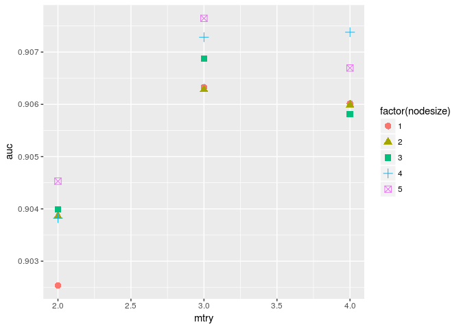
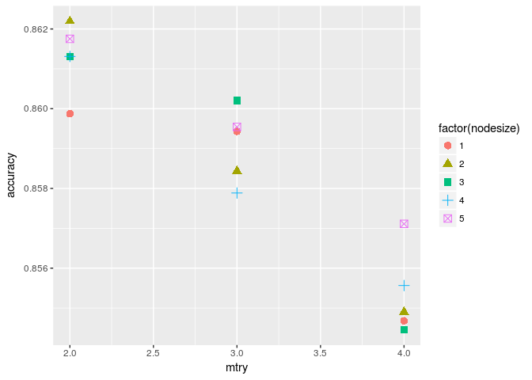
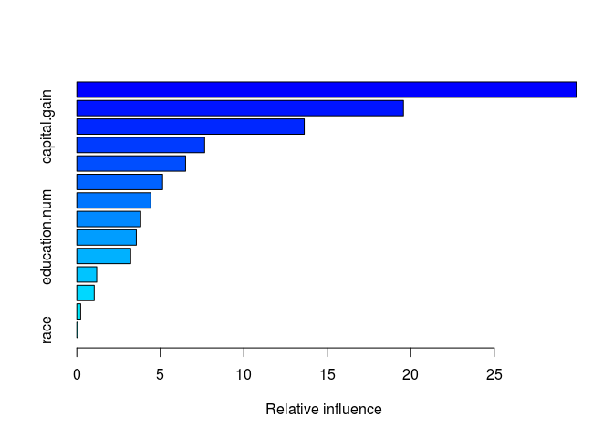
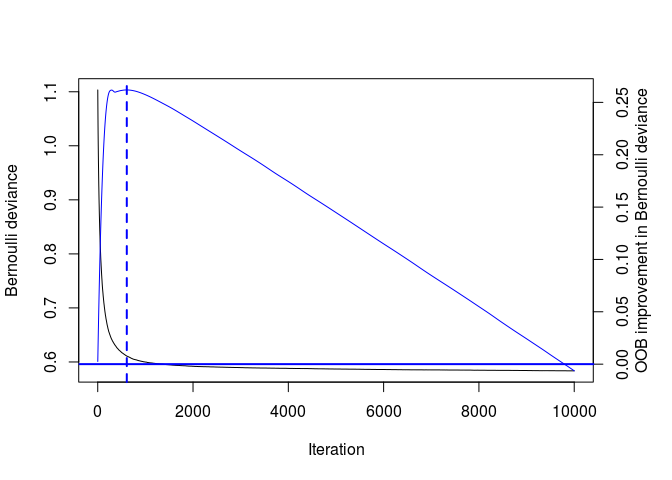
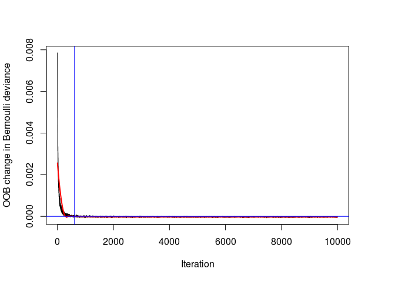
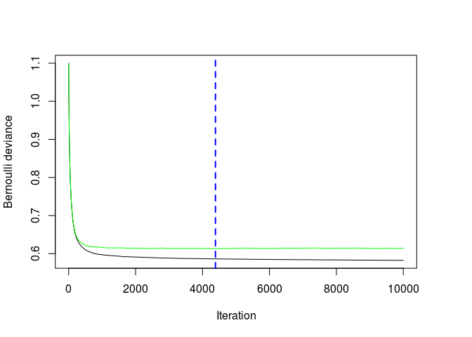

Random Forest parameter tuning & GBM
================

In order to find optimal mtry and nodesize a grid search is implemented.

``` r
# converting ? to NA

levels(data$workclass)[1] <- NA
levels(data$occupation)[1] <- NA
levels(data$native.country)[1] <- NA
data <- na.omit(data)

levels(data$over50K)[1] <- "under50K"
levels(data$over50K)[2] <- "over50K"


# Creating train-test split
set.seed(1234)
train <- sample(nrow(data), 0.7*nrow(data))
data.train <- data[train,]
data.test <- data[-train,]

library(caret)
library(Metrics)

# Training a Random Forest
library(randomForest)
library(ggplot2)

############################################
####### Tuning mtry and nodesize ###########
############################################
mtry <- c(2,3,4)
nodesize <- seq(1, 5, 1)

# Creating a data frame containing all combinations 
hyper_grid <- expand.grid(mtry = mtry, nodesize = nodesize)

sub_results <- apply(hyper_grid, 1, function(hpgrid){
                mtry <- hpgrid[['mtry']]
                nodesize <- hpgrid[['nodesize']]
                
                income_model <- randomForest(formula = over50K ~ ., 
                                             data = data.train, mtry=mtry, ntree=200, 
                                             nodesize = nodesize)
                
                class_prediction <- predict(object = income_model,   # model object 
                                            newdata = data.test,  # test dataset
                                            type = "class") # return classification labels
                
                rf_accuracy <- sum(class_prediction == data.test$over50K)/nrow(data.test)
                
                pred <- predict(object = income_model,
                                newdata = data.test,
                                type = "prob")
                
                auc <- auc(actual = ifelse(data.test$over50K == "over50K", 1, 0), 
                                   predicted = pred[,2]) 
  return(c(rf_accuracy ,auc))
})


results <- cbind(hyper_grid, data.frame(t(sub_results)))
names(results) <- c("mtry", "nodesize", "accuracy", "auc")

results[order(results$auc, results$accuracy, decreasing = TRUE), ]
```

    ##    mtry nodesize  accuracy       auc
    ## 14    3        5 0.8595425 0.9076446
    ## 12    4        4 0.8555642 0.9073797
    ## 11    3        4 0.8578848 0.9072844
    ## 8     3        3 0.8602055 0.9068736
    ## 15    4        5 0.8571113 0.9066950
    ## 2     3        1 0.8594320 0.9063281
    ## 5     3        2 0.8584374 0.9062816
    ## 3     4        1 0.8546801 0.9060165
    ## 6     4        2 0.8549011 0.9059863
    ## 9     4        3 0.8544591 0.9058106
    ## 13    2        5 0.8617527 0.9045301
    ## 7     2        3 0.8613106 0.9039880
    ## 4     2        2 0.8621947 0.9038637
    ## 10    2        4 0.8613106 0.9038252
    ## 1     2        1 0.8598740 0.9025374

``` r
max_auc <- results[which.max(results$auc),]

max_acc <- results[which.max(results$accuracy),]

library(ggplot2)
ggplot(results, aes(mtry, auc, color=factor(nodesize), shape=factor(nodesize)))+
  geom_point(size=3)
```



``` r
ggplot(results, aes(mtry, accuracy, color=factor(nodesize), shape=factor(nodesize)))+
  geom_point(size=3)
```



The highest auc is 0.9076446 and hyperparameters: mtry is 3 and nodesize is 5.

The highest test set accuracy is 0.8621947 and the hyperparameters: mtry is 2 and nodesize is 2.

``` r
data.train$over50K <- ifelse(data.train$over50K == "over50K", 1, 0)

# Train a 10000-tree GBM model
library(gbm)
set.seed(1234)
income_model <- gbm(formula = over50K ~ ., 
                    distribution = "bernoulli", 
                    data = data.train,
                    n.trees = 10000, shrinkage = 0.04)

# Print the model object                    
print(income_model)
```

    ## gbm(formula = over50K ~ ., distribution = "bernoulli", data = data.train, 
    ##     n.trees = 10000, shrinkage = 0.04)
    ## A gradient boosted model with bernoulli loss function.
    ## 10000 iterations were performed.
    ## There were 14 predictors of which 14 had non-zero influence.

``` r
summary(income_model)
```



    ##                           var     rel.inf
    ## native.country native.country 29.91229255
    ## relationship     relationship 19.56303651
    ## capital.gain     capital.gain 13.62422121
    ## occupation         occupation  7.65696092
    ## education           education  6.51556383
    ## capital.loss     capital.loss  5.13695009
    ## marital.status marital.status  4.43299230
    ## age                       age  3.82949109
    ## education.num   education.num  3.56504164
    ## hours.per.week hours.per.week  3.22786792
    ## workclass           workclass  1.19364593
    ## fnlwgt                 fnlwgt  1.04421986
    ## sex                       sex  0.22972260
    ## race                     race  0.06799355

``` r
data.test$over50K <- ifelse(data.test$over50K == "over50K", 1, 0)


# Optimal ntree estimate based on OOB
ntree_opt_oob <- gbm.perf(object = income_model, 
                          method = "OOB", 
                          oobag.curve = TRUE)
```



``` r
# Training a CV GBM model
set.seed(1234)
income_model_cv <- gbm(formula = over50K ~ ., 
                       distribution = "bernoulli", 
                       data = data.train,
                       n.trees = 10000,
                       cv.folds = 2, shrinkage = 0.05)

# Optimal ntree estimate based on CV
ntree_opt_cv <- gbm.perf(object = income_model_cv, 
                         method = "cv")
```



``` r
# Comparing the estimates                        
print(paste0("Optimal n.trees (OOB Estimate): ", ntree_opt_oob))                         
```

    ## [1] "Optimal n.trees (OOB Estimate): 610"

``` r
print(paste0("Optimal n.trees (CV Estimate): ", ntree_opt_cv))
```

    ## [1] "Optimal n.trees (CV Estimate): 4387"

``` r
# Generating predictions on the test set using ntree_opt_oob number of trees
preds1 <- predict(object = income_model, 
                  newdata = data.test,
                  n.trees = ntree_opt_oob)

# Generating predictions on the test set using ntree_opt_cv number of trees
preds2 <- predict(object = income_model_cv, 
                  newdata = data.test,
                  n.trees = ntree_opt_cv)   

# Generate the test set AUCs using the two sets of preditions & compare
auc1 <- auc(actual = data.test$over50K, predicted = preds1)  #OOB
auc2 <- auc(actual = data.test$over50K, predicted = preds2)  #CV 

# Compare AUC 
print(paste0("Test set AUC (OOB): ", auc1))                         
```

    ## [1] "Test set AUC (OOB): 0.910397801000292"

``` r
print(paste0("Test set AUC (CV): ", auc2))
```

    ## [1] "Test set AUC (CV): 0.914827388987672"

``` r
prob <- predict(income_model_cv, data.test, type = "response", n.trees = ntree_opt_cv)
gbm.pred <- factor(prob > .5, labels = c("under50K", "over50K"))
gbm_acc <- sum(gbm.pred == factor(data.test$over50K, labels = c("under50K", "over50K")))/nrow(data.test)
```

### AUC and accuracy from the gbm model

AUC (OOB): 0.9103978

AUC (CV): 0.9148274

Accuracy: 0.8621947
