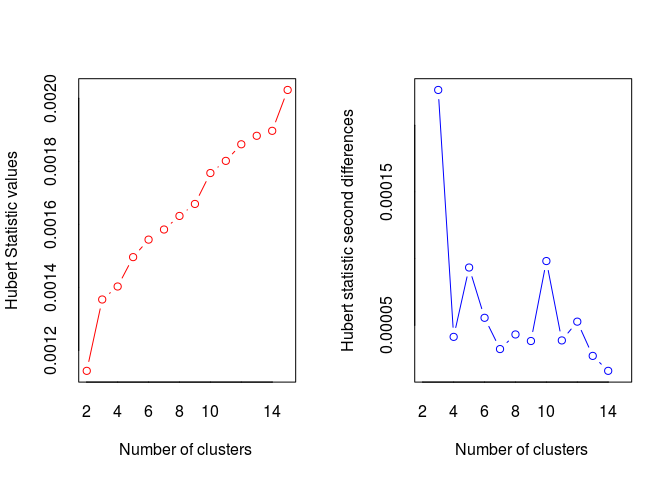

Clustering
================

Hierarchical Clustering
-----------------------

This is a simple clustering example that goes through some basic clustering methods in R. First I will try to put different foods to clusters based on their nutrient data. At the end a dendogram is plotted with a 5 cluster solution.

``` r
library(cluster)
library(NbClust)
library(flexclust)
library(fMultivar)
library(ggplot2)


#loading the data

data(nutrient, package="flexclust")
head(nutrient, 4)
```

    ##              energy protein fat calcium iron
    ## BEEF BRAISED    340      20  28       9  2.6
    ## HAMBURGER       245      21  17       9  2.7
    ## BEEF ROAST      420      15  39       7  2.0
    ## BEEF STEAK      375      19  32       9  2.6

``` r
# calculating distance
d <- dist(nutrient)
as.matrix(d)[1:4, 1:4]
```

    ##              BEEF BRAISED HAMBURGER BEEF ROAST BEEF STEAK
    ## BEEF BRAISED      0.00000   95.6400   80.93429   35.24202
    ## HAMBURGER        95.64000    0.0000  176.49218  130.87784
    ## BEEF ROAST       80.93429  176.4922    0.00000   45.76418
    ## BEEF STEAK       35.24202  130.8778   45.76418    0.00000

``` r
# Average-linkage clustering of the nutrient data
row.names(nutrient) <- tolower(row.names(nutrient))
nutrient.scaled <- scale(nutrient)

d <- dist(nutrient.scaled)

fit.average <- hclust(d, method = "average")
plot(fit.average, hang=-1, cex=.8)
```


``` r
#Selecting the number of clusters
nc <- NbClust(nutrient.scaled, distance = "euclidean",
              min.nc = 2, max.nc = 15, method = "average")
```


    ## *** : The Hubert index is a graphical method of determining the number of clusters.
    ##                 In the plot of Hubert index, we seek a significant knee that corresponds to a 
    ##                 significant increase of the value of the measure i.e the significant peak in Hubert
    ##                 index second differences plot. 
    ## 


    ## *** : The D index is a graphical method of determining the number of clusters. 
    ##                 In the plot of D index, we seek a significant knee (the significant peak in Dindex
    ##                 second differences plot) that corresponds to a significant increase of the value of
    ##                 the measure. 
    ##  
    ## ******************************************************************* 
    ## * Among all indices:                                                
    ## * 4 proposed 2 as the best number of clusters 
    ## * 4 proposed 3 as the best number of clusters 
    ## * 2 proposed 4 as the best number of clusters 
    ## * 4 proposed 5 as the best number of clusters 
    ## * 1 proposed 9 as the best number of clusters 
    ## * 1 proposed 10 as the best number of clusters 
    ## * 2 proposed 13 as the best number of clusters 
    ## * 1 proposed 14 as the best number of clusters 
    ## * 4 proposed 15 as the best number of clusters 
    ## 
    ##                    ***** Conclusion *****                            
    ##  
    ## * According to the majority rule, the best number of clusters is  2 
    ##  
    ##  
    ## *******************************************************************

``` r
table(nc$Best.nc[1,])
```

    ## 
    ##  0  1  2  3  4  5  9 10 13 14 15 
    ##  2  1  4  4  2  4  1  1  2  1  4

``` r
barplot(table(nc$Best.nc[1,]))

clusters <- cutree(fit.average, k=5)
table(clusters)
```

    ## clusters
    ##  1  2  3  4  5 
    ##  7 16  1  2  1

``` r
aggregate(nutrient, by=list(cluster=clusters), median)
```

    ##   cluster energy protein fat calcium iron
    ## 1       1  340.0      19  29       9 2.50
    ## 2       2  170.0      20   8      13 1.45
    ## 3       3  160.0      26   5      14 5.90
    ## 4       4   57.5       9   1      78 5.70
    ## 5       5  180.0      22   9     367 2.50

``` r
aggregate(as.data.frame(nutrient.scaled), by=list(cluster=clusters), median)
```

    ##   cluster     energy    protein        fat    calcium        iron
    ## 1       1  1.3101024  0.0000000  1.3785620 -0.4480464  0.08110456
    ## 2       2 -0.3696099  0.2352002 -0.4869384 -0.3967868 -0.63743114
    ## 3       3 -0.4684165  1.6464016 -0.7534384 -0.3839719  2.40779157
    ## 4       4 -1.4811842 -2.3520023 -1.1087718  0.4361807  2.27092763
    ## 5       5 -0.2708033  0.7056007 -0.3981050  4.1396825  0.08110456

``` r
par(mfrow=c(1,1))
```


``` r
plot(fit.average, hang=-1, cex=.8, main="5 cluster solution")
rect.hclust(fit.average, k=5)
```


Kmeans clustering
=================

Next I will apply k-means clustering to wine dataset. There are 3 wine varietals, so a we should find a three cluster solution.

``` r
# Wine data
library(rattle)

data(wine, package="rattle")
head(wine)
```

    ##   Type Alcohol Malic  Ash Alcalinity Magnesium Phenols Flavanoids
    ## 1    1   14.23  1.71 2.43       15.6       127    2.80       3.06
    ## 2    1   13.20  1.78 2.14       11.2       100    2.65       2.76
    ## 3    1   13.16  2.36 2.67       18.6       101    2.80       3.24
    ## 4    1   14.37  1.95 2.50       16.8       113    3.85       3.49
    ## 5    1   13.24  2.59 2.87       21.0       118    2.80       2.69
    ## 6    1   14.20  1.76 2.45       15.2       112    3.27       3.39
    ##   Nonflavanoids Proanthocyanins Color  Hue Dilution Proline
    ## 1          0.28            2.29  5.64 1.04     3.92    1065
    ## 2          0.26            1.28  4.38 1.05     3.40    1050
    ## 3          0.30            2.81  5.68 1.03     3.17    1185
    ## 4          0.24            2.18  7.80 0.86     3.45    1480
    ## 5          0.39            1.82  4.32 1.04     2.93     735
    ## 6          0.34            1.97  6.75 1.05     2.85    1450

``` r
wssplot <- function(data, nc=15, seed=1234){
            wss <- (nrow(data)-1)*sum(apply(data,2,var))
            for (i in 2:nc) {
              set.seed(seed)
              wss[i] <- sum(kmeans(data, centers = i)$withinss)
            }
            plot(1:nc, wss, type="b", xlab="Number of clusters", ylab="Within groups sum of squares")
}

df <- scale(wine[-1])
wssplot(df)
```


``` r
set.seed(1234)
nc <- NbClust(df, min.nc = 2, max.nc = 15, method = "kmean")
```



    ## *** : The Hubert index is a graphical method of determining the number of clusters.
    ##                 In the plot of Hubert index, we seek a significant knee that corresponds to a 
    ##                 significant increase of the value of the measure i.e the significant peak in Hubert
    ##                 index second differences plot. 
    ## 


    ## *** : The D index is a graphical method of determining the number of clusters. 
    ##                 In the plot of D index, we seek a significant knee (the significant peak in Dindex
    ##                 second differences plot) that corresponds to a significant increase of the value of
    ##                 the measure. 
    ##  
    ## ******************************************************************* 
    ## * Among all indices:                                                
    ## * 4 proposed 2 as the best number of clusters 
    ## * 15 proposed 3 as the best number of clusters 
    ## * 1 proposed 10 as the best number of clusters 
    ## * 1 proposed 12 as the best number of clusters 
    ## * 1 proposed 14 as the best number of clusters 
    ## * 1 proposed 15 as the best number of clusters 
    ## 
    ##                    ***** Conclusion *****                            
    ##  
    ## * According to the majority rule, the best number of clusters is  3 
    ##  
    ##  
    ## *******************************************************************

``` r
table(nc$Best.nc[1,])
```

    ## 
    ##  0  1  2  3 10 12 14 15 
    ##  2  1  4 15  1  1  1  1

``` r
par(mfrow=c(1,1))
barplot(table(nc$Best.nc[1,]), xlab="Number of clusters", ylab="Number of criteria", main="Number of Clusters chosen by 26 criteria")
```


``` r
fit.km <- kmeans(df, 3, nstart = 25)
fit.km$size
```

    ## [1] 51 65 62

``` r
fit.km$centers
```

    ##      Alcohol      Malic        Ash Alcalinity   Magnesium     Phenols
    ## 1  0.1644436  0.8690954  0.1863726  0.5228924 -0.07526047 -0.97657548
    ## 2 -0.9234669 -0.3929331 -0.4931257  0.1701220 -0.49032869 -0.07576891
    ## 3  0.8328826 -0.3029551  0.3636801 -0.6084749  0.57596208  0.88274724
    ##    Flavanoids Nonflavanoids Proanthocyanins      Color        Hue
    ## 1 -1.21182921    0.72402116     -0.77751312  0.9388902 -1.1615122
    ## 2  0.02075402   -0.03343924      0.05810161 -0.8993770  0.4605046
    ## 3  0.97506900   -0.56050853      0.57865427  0.1705823  0.4726504
    ##     Dilution    Proline
    ## 1 -1.2887761 -0.4059428
    ## 2  0.2700025 -0.7517257
    ## 3  0.7770551  1.1220202

``` r
aggregate(wine[-1], by=list(cluster=fit.km$cluster), mean)
```

    ##   cluster  Alcohol    Malic      Ash Alcalinity Magnesium  Phenols
    ## 1       1 13.13412 3.307255 2.417647   21.24118  98.66667 1.683922
    ## 2       2 12.25092 1.897385 2.231231   20.06308  92.73846 2.247692
    ## 3       3 13.67677 1.997903 2.466290   17.46290 107.96774 2.847581
    ##   Flavanoids Nonflavanoids Proanthocyanins    Color       Hue Dilution
    ## 1  0.8188235     0.4519608        1.145882 7.234706 0.6919608 1.696667
    ## 2  2.0500000     0.3576923        1.624154 2.973077 1.0627077 2.803385
    ## 3  3.0032258     0.2920968        1.922097 5.453548 1.0654839 3.163387
    ##     Proline
    ## 1  619.0588
    ## 2  510.1692
    ## 3 1100.2258

``` r
ct.km <- table(wine$Type, fit.km$cluster)
ct.km
```

    ##    
    ##      1  2  3
    ##   1  0  0 59
    ##   2  3 65  3
    ##   3 48  0  0

``` r
ri<-randIndex(ct.km)
```

The Rand index provides a measure of the agreement between two partitions. Here the Rand index is 0.897495. Not bad!

Now let's try partitioning around medoids. K-means clustering is sensitive to outliers, partitioning around medioids(PAM) might provide a more robust solution.

``` r
fit.pam <- pam(wine[-1], k=3, stand=TRUE)
fit.pam$medoids
```

    ##      Alcohol Malic  Ash Alcalinity Magnesium Phenols Flavanoids
    ## [1,]   13.48  1.81 2.41       20.5       100    2.70       2.98
    ## [2,]   12.25  1.73 2.12       19.0        80    1.65       2.03
    ## [3,]   13.40  3.91 2.48       23.0       102    1.80       0.75
    ##      Nonflavanoids Proanthocyanins Color  Hue Dilution Proline
    ## [1,]          0.26            1.86   5.1 1.04     3.47     920
    ## [2,]          0.37            1.63   3.4 1.00     3.17     510
    ## [3,]          0.43            1.41   7.3 0.70     1.56     750

``` r
clusplot(fit.pam, main = "Bivariate cluster plot")
```


``` r
ct.pam <- table(wine$Type, fit.pam$clustering)
pam_ri <- randIndex(ct.pam)
```

Rand index has now decreased to 0.6994957
