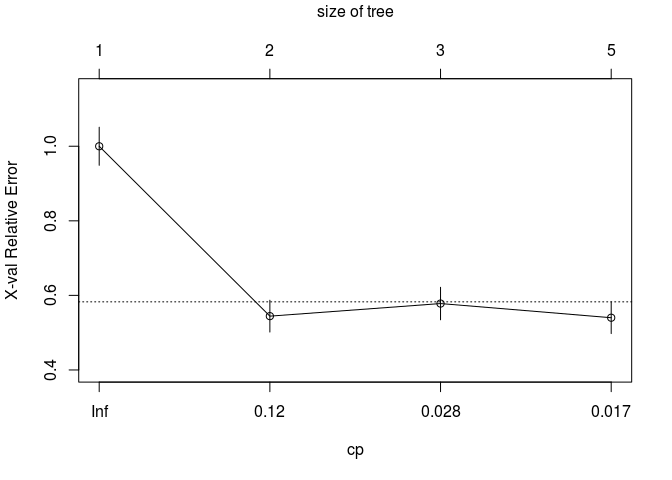
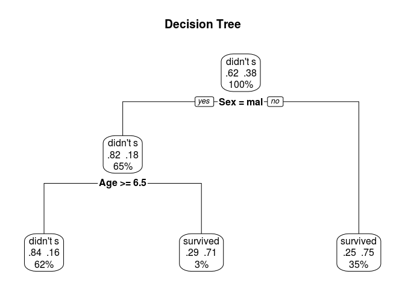
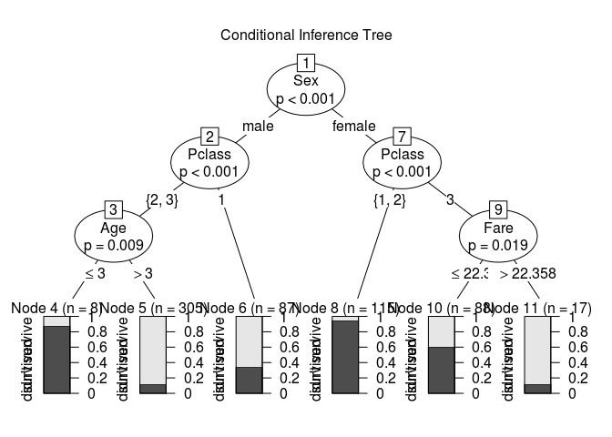

Machine Learning - Titanic
================

The data & Background
---------------------

I got the data from [here](http://web.stanford.edu/class/archive/cs/cs109/cs109.1166/stuff/titanic.csv) and it is the Titanic survival dataset. The idea is to use machine learning algorithms in order to predict who will survive in Titanic.

First we need to import the data and prepare it for analysis:

``` r
titanic <- read.csv("/home/pekka/Downloads/titanic.csv", stringsAsFactors = FALSE)
head(titanic)
```

    ##   Survived Pclass                                               Name
    ## 1        0      3                             Mr. Owen Harris Braund
    ## 2        1      1 Mrs. John Bradley (Florence Briggs Thayer) Cumings
    ## 3        1      3                              Miss. Laina Heikkinen
    ## 4        1      1        Mrs. Jacques Heath (Lily May Peel) Futrelle
    ## 5        0      3                            Mr. William Henry Allen
    ## 6        0      3                                    Mr. James Moran
    ##      Sex Age Siblings.Spouses.Aboard Parents.Children.Aboard    Fare
    ## 1   male  22                       1                       0  7.2500
    ## 2 female  38                       1                       0 71.2833
    ## 3 female  26                       0                       0  7.9250
    ## 4 female  35                       1                       0 53.1000
    ## 5   male  35                       0                       0  8.0500
    ## 6   male  27                       0                       0  8.4583

``` r
str(titanic)
```

    ## 'data.frame':    887 obs. of  8 variables:
    ##  $ Survived               : int  0 1 1 1 0 0 0 0 1 1 ...
    ##  $ Pclass                 : int  3 1 3 1 3 3 1 3 3 2 ...
    ##  $ Name                   : chr  "Mr. Owen Harris Braund" "Mrs. John Bradley (Florence Briggs Thayer) Cumings" "Miss. Laina Heikkinen" "Mrs. Jacques Heath (Lily May Peel) Futrelle" ...
    ##  $ Sex                    : chr  "male" "female" "female" "female" ...
    ##  $ Age                    : num  22 38 26 35 35 27 54 2 27 14 ...
    ##  $ Siblings.Spouses.Aboard: int  1 1 0 1 0 0 0 3 0 1 ...
    ##  $ Parents.Children.Aboard: int  0 0 0 0 0 0 0 1 2 0 ...
    ##  $ Fare                   : num  7.25 71.28 7.92 53.1 8.05 ...

``` r
titanic <- titanic[-3]
titanic$Survived <- factor(titanic$Survived, levels = c(0,1), labels = c("didn't survive", "survived"))
titanic$Pclass <- factor(titanic$Pclass)
titanic$Sex <- factor(titanic$Sex)


set.seed(1234)
train <- sample(nrow(titanic), 0.7*nrow(titanic))
titanic.train <- titanic[train, ]
titanic.validate <- titanic[-train, ]
table(titanic.train$Survived)
```

    ## 
    ## didn't survive       survived 
    ##            383            237

``` r
table(titanic.validate$Survived)
```

    ## 
    ## didn't survive       survived 
    ##            162            105

Logistic regression
-------------------

The data is now devided in to training data and test(validate) data. We will use the train data to fit the models and test data to evaluate the performance of the model.

Logistic regression is fitted with the glm() function which is included in the base installation of R.

``` r
fit.logit <- glm(Survived~., data = titanic.train, family = binomial())
summary(fit.logit)
```

    ## 
    ## Call:
    ## glm(formula = Survived ~ ., family = binomial(), data = titanic.train)
    ## 
    ## Deviance Residuals: 
    ##     Min       1Q   Median       3Q      Max  
    ## -2.3867  -0.5801  -0.3978   0.6230   2.4364  
    ## 
    ## Coefficients:
    ##                          Estimate Std. Error z value Pr(>|z|)    
    ## (Intercept)              4.050005   0.552324   7.333 2.26e-13 ***
    ## Pclass2                 -1.206998   0.362861  -3.326  0.00088 ***
    ## Pclass3                 -2.307409   0.365050  -6.321 2.60e-10 ***
    ## Sexmale                 -2.802823   0.239646 -11.696  < 2e-16 ***
    ## Age                     -0.041531   0.009321  -4.456 8.36e-06 ***
    ## Siblings.Spouses.Aboard -0.415657   0.140888  -2.950  0.00318 ** 
    ## Parents.Children.Aboard -0.067824   0.147321  -0.460  0.64524    
    ## Fare                     0.002165   0.003016   0.718  0.47283    
    ## ---
    ## Signif. codes:  0 '***' 0.001 '**' 0.01 '*' 0.05 '.' 0.1 ' ' 1
    ## 
    ## (Dispersion parameter for binomial family taken to be 1)
    ## 
    ##     Null deviance: 824.80  on 619  degrees of freedom
    ## Residual deviance: 543.92  on 612  degrees of freedom
    ## AIC: 559.92
    ## 
    ## Number of Fisher Scoring iterations: 5

``` r
prob <- predict(fit.logit, titanic.validate, type="response")
logit.pred <- factor(prob > .5, levels = c(FALSE, TRUE), labels = c("didn't survive", "survived"))
logit.perf <- table(titanic.validate$Survived, logit.pred, dnn = c("Actual", "Predicted"))

logit.perf
```

    ##                 Predicted
    ## Actual           didn't survive survived
    ##   didn't survive            144       18
    ##   survived                   37       68

It seems like `Parents.Children.Aboard` and `Fare` are not significant variables, so let's remove them from the regression. This can be done using stepwise logistic regression:

``` r
logit.fit.reduced <- step(fit.logit)
```

    ## Start:  AIC=559.92
    ## Survived ~ Pclass + Sex + Age + Siblings.Spouses.Aboard + Parents.Children.Aboard + 
    ##     Fare
    ## 
    ##                           Df Deviance    AIC
    ## - Parents.Children.Aboard  1   544.14 558.14
    ## - Fare                     1   544.47 558.47
    ## <none>                         543.92 559.92
    ## - Siblings.Spouses.Aboard  1   554.66 568.66
    ## - Age                      1   565.45 579.45
    ## - Pclass                   2   586.98 598.98
    ## - Sex                      1   718.78 732.78
    ## 
    ## Step:  AIC=558.14
    ## Survived ~ Pclass + Sex + Age + Siblings.Spouses.Aboard + Fare
    ## 
    ##                           Df Deviance    AIC
    ## - Fare                     1   544.59 556.59
    ## <none>                         544.14 558.14
    ## - Siblings.Spouses.Aboard  1   556.88 568.88
    ## - Age                      1   565.49 577.49
    ## - Pclass                   2   588.31 598.31
    ## - Sex                      1   722.99 734.99
    ## 
    ## Step:  AIC=556.59
    ## Survived ~ Pclass + Sex + Age + Siblings.Spouses.Aboard
    ## 
    ##                           Df Deviance    AIC
    ## <none>                         544.59 556.59
    ## - Siblings.Spouses.Aboard  1   556.88 566.88
    ## - Age                      1   566.84 576.84
    ## - Pclass                   2   620.91 628.91
    ## - Sex                      1   727.33 737.33

``` r
summary(logit.fit.reduced)
```

    ## 
    ## Call:
    ## glm(formula = Survived ~ Pclass + Sex + Age + Siblings.Spouses.Aboard, 
    ##     family = binomial(), data = titanic.train)
    ## 
    ## Deviance Residuals: 
    ##     Min       1Q   Median       3Q      Max  
    ## -2.3649  -0.5741  -0.3947   0.6255   2.4441  
    ## 
    ## Coefficients:
    ##                          Estimate Std. Error z value Pr(>|z|)    
    ## (Intercept)              4.197700   0.490142   8.564  < 2e-16 ***
    ## Pclass2                 -1.332108   0.322549  -4.130 3.63e-05 ***
    ## Pclass3                 -2.454064   0.305582  -8.031 9.69e-16 ***
    ## Sexmale                 -2.792408   0.233795 -11.944  < 2e-16 ***
    ## Age                     -0.041916   0.009262  -4.526 6.02e-06 ***
    ## Siblings.Spouses.Aboard -0.416404   0.134096  -3.105   0.0019 ** 
    ## ---
    ## Signif. codes:  0 '***' 0.001 '**' 0.01 '*' 0.05 '.' 0.1 ' ' 1
    ## 
    ## (Dispersion parameter for binomial family taken to be 1)
    ## 
    ##     Null deviance: 824.80  on 619  degrees of freedom
    ## Residual deviance: 544.59  on 614  degrees of freedom
    ## AIC: 556.59
    ## 
    ## Number of Fisher Scoring iterations: 5

``` r
prob <- predict(logit.fit.reduced , titanic.validate, type="response")
logit.pred <- factor(prob > .5, levels = c(FALSE, TRUE), labels = c("didn't survive", "survived"))
logit.perf <- table(titanic.validate$Survived, logit.pred, dnn = c("Actual", "Predicted"))

logit.perf
```

    ##                 Predicted
    ## Actual           didn't survive survived
    ##   didn't survive            141       21
    ##   survived                   36       69

Decision Tree
-------------

Decision trees can be created with the `rpart` command from the `rpart` package:

``` r
library(rpart)
set.seed(1234)

dtree <- rpart(Survived~., data = titanic.train, method = "class", parms = list(split="information"))
dtree$cptable
```

    ##           CP nsplit rel error    xerror       xstd
    ## 1 0.45569620      0 1.0000000 1.0000000 0.05105395
    ## 2 0.02953586      1 0.5443038 0.5443038 0.04264729
    ## 3 0.02742616      2 0.5147679 0.5780591 0.04359028
    ## 4 0.01000000      4 0.4599156 0.5400844 0.04252490

``` r
plotcp(dtree)
```



``` r
dtree.pruned <- prune(dtree, cp=0.02953586)

library(rpart.plot)
prp(dtree.pruned, type = 2, extra = 104, fallen.leaves = TRUE, main="Decision Tree")
```



``` r
dtree.pred <- predict(dtree.pruned, titanic.validate, type = "class")
dtree.perf <- table(titanic.validate$Survived, dtree.pred, dnn = c("Actual", "Predicted"))

dtree.perf
```

    ##                 Predicted
    ## Actual           didn't survive survived
    ##   didn't survive            132       30
    ##   survived                   31       74

Conditional inference tree
--------------------------

Conditional inference trees are similar to classical decision trees but the way variables and splits are selected is a bit different. I won't go into the details about the theories behind these algorithms in here.

``` r
library(party)
```

    ## Loading required package: grid

    ## Loading required package: mvtnorm

    ## Loading required package: modeltools

    ## Loading required package: stats4

    ## Loading required package: strucchange

    ## Loading required package: zoo

    ## 
    ## Attaching package: 'zoo'

    ## The following objects are masked from 'package:base':
    ## 
    ##     as.Date, as.Date.numeric

    ## Loading required package: sandwich

``` r
fit.ctree <- ctree(Survived~., data = titanic.train)
plot(fit.ctree, main="Conditional Inference Tree")
```



``` r
ctree.pred <- predict(fit.ctree, titanic.validate, type="response")
ctree.perf <- table(titanic.validate$Survived, ctree.pred, dnn = c("Actual", "Predicted"))

ctree.perf
```

    ##                 Predicted
    ## Actual           didn't survive survived
    ##   didn't survive            142       20
    ##   survived                   33       72

Random forest
-------------

Random forest algorithm creates a large number of decision trees and the most common classification for each case is selected. The `randomForest` package is great for growing random forests! Random forests also provide a measure of variable importance. It seems that `Sex` is the most important variable and `Parents.Children.Aboard` is the least important.

``` r
library(randomForest)
```

    ## randomForest 4.6-14

    ## Type rfNews() to see new features/changes/bug fixes.

``` r
set.seed(1234)
fit.forest <- randomForest(Survived~., data = titanic.train, na.action = na.roughfix, importance=TRUE)
fit.forest
```

    ## 
    ## Call:
    ##  randomForest(formula = Survived ~ ., data = titanic.train, importance = TRUE,      na.action = na.roughfix) 
    ##                Type of random forest: classification
    ##                      Number of trees: 500
    ## No. of variables tried at each split: 2
    ## 
    ##         OOB estimate of  error rate: 17.74%
    ## Confusion matrix:
    ##                didn't survive survived class.error
    ## didn't survive            346       37  0.09660574
    ## survived                   73      164  0.30801688

``` r
importance(fit.forest, type = 2)
```

    ##                         MeanDecreaseGini
    ## Pclass                         21.944185
    ## Sex                            78.041082
    ## Age                            44.441984
    ## Siblings.Spouses.Aboard        12.804910
    ## Parents.Children.Aboard         8.915862
    ## Fare                           47.349735

``` r
forest.pred <- predict(fit.forest, titanic.validate)
forest.perf <- table(titanic.validate$Survived, forest.pred, dnn = c("Actual", "Predicted"))     
forest.perf
```

    ##                 Predicted
    ## Actual           didn't survive survived
    ##   didn't survive            148       14
    ##   survived                   29       76

Support vector machine
----------------------

Support vector machines are a popular machine learning models that can be used for classification and regression. You need the `e1071` package to fit an svm model:

``` r
library(e1071)
set.seed(1234)
fit.svm <- svm(Survived~., data = titanic.train)
fit.svm
```

    ## 
    ## Call:
    ## svm(formula = Survived ~ ., data = titanic.train)
    ## 
    ## 
    ## Parameters:
    ##    SVM-Type:  C-classification 
    ##  SVM-Kernel:  radial 
    ##        cost:  1 
    ##       gamma:  0.125 
    ## 
    ## Number of Support Vectors:  303

``` r
svm.pred <- predict(fit.svm, na.omit(titanic.validate))
svm.perf <- table(titanic.validate$Survived, svm.pred, dnn = c("Actual", "Predicted"))
svm.perf
```

    ##                 Predicted
    ## Actual           didn't survive survived
    ##   didn't survive            144       18
    ##   survived                   30       75

The best model
--------------

So which model is the best at predicting survival at the Titanic? Here is a function, which calculates five measures of predictive accuracy. The measures are:

-   Sensitivity, or true positive rate
-   Specificity, true negative rate
-   Positive Predictive Value, Probability that an observation with a positive classification is correctly identified as positive
-   Negative Predictive Value, similar to Positive predictive value
-   Accuracy, Proportion of observations correctly identified

The performance measures are calculated for each model:

``` r
performance <- function(table, n=2){
  if(!all(dim(table) == c(2,2)))
    stop("Must be a 2x2 table")
  tn = table[1,1]
  fp = table[1,2]
  fn = table[2,1]
  tp = table[2,2]
  sensitivity = tp/(tp+fn)
  specificity = tn/(tn+fp)
  ppp = tp/(tp+fp)
  npp = tn/(tn+fn)
  hitrate = (tp+tn)/(tp+tn+fp+fn)
  result <- paste("Sensitivity = ", round(sensitivity, n) ,
                  "\nSpecificity = ", round(specificity, n), 
                  "\nPositive Predictive Value = ", round(ppp, n),
                  "\nNegative Predictive Value = ", round(npp, n),
                  "\nAccuracy = ", round(hitrate, n), "\n", sep = "")
  cat(result)
}
performance(logit.perf)
```

    ## Sensitivity = 0.66
    ## Specificity = 0.87
    ## Positive Predictive Value = 0.77
    ## Negative Predictive Value = 0.8
    ## Accuracy = 0.79

``` r
performance(dtree.perf)
```

    ## Sensitivity = 0.7
    ## Specificity = 0.81
    ## Positive Predictive Value = 0.71
    ## Negative Predictive Value = 0.81
    ## Accuracy = 0.77

``` r
performance(ctree.perf)
```

    ## Sensitivity = 0.69
    ## Specificity = 0.88
    ## Positive Predictive Value = 0.78
    ## Negative Predictive Value = 0.81
    ## Accuracy = 0.8

``` r
performance(forest.perf)
```

    ## Sensitivity = 0.72
    ## Specificity = 0.91
    ## Positive Predictive Value = 0.84
    ## Negative Predictive Value = 0.84
    ## Accuracy = 0.84

``` r
performance(svm.perf)
```

    ## Sensitivity = 0.71
    ## Specificity = 0.89
    ## Positive Predictive Value = 0.81
    ## Negative Predictive Value = 0.83
    ## Accuracy = 0.82

All the models have pretty similar performance measures but Random Forest has the highest value for every measure, so from these models the Random forest seems to be the best at predicting survival on the Titanic!
