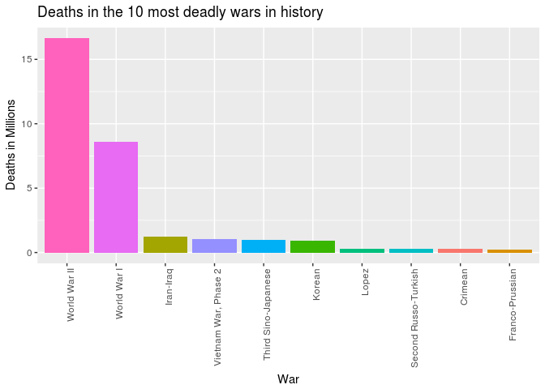
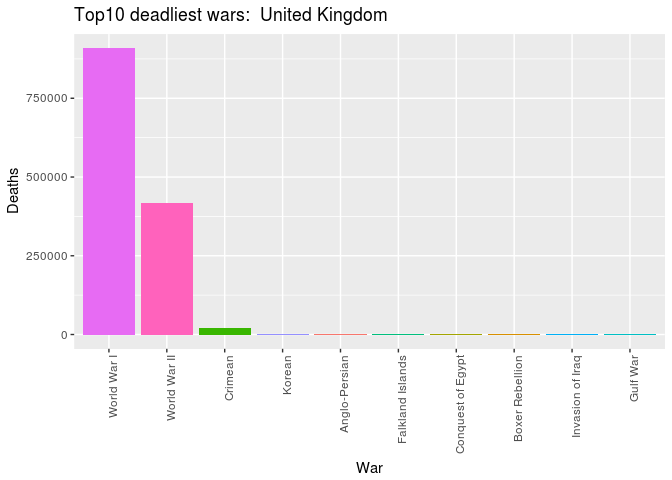
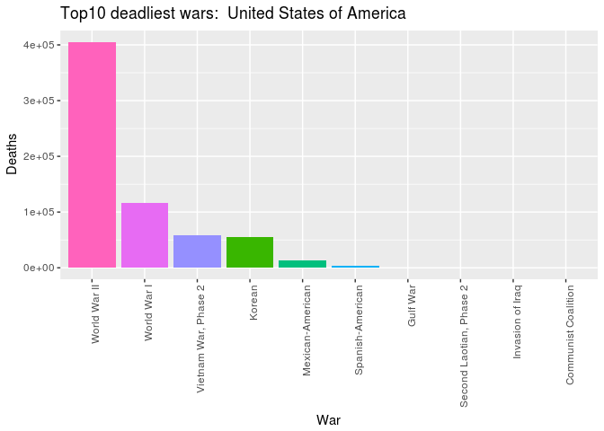
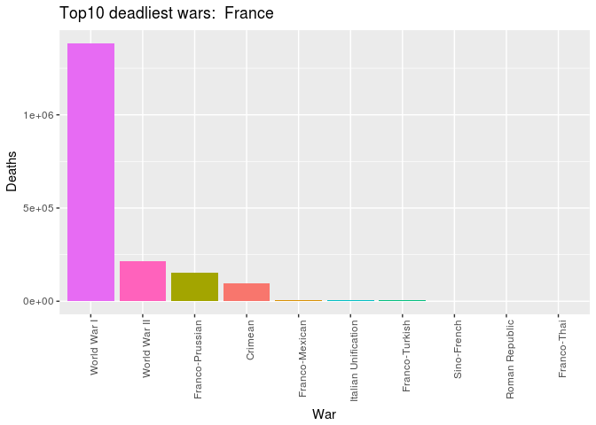
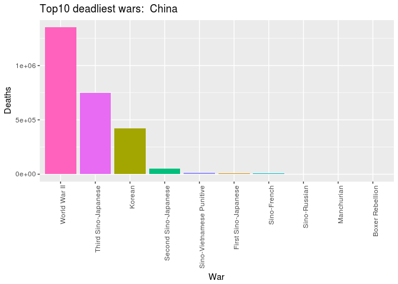
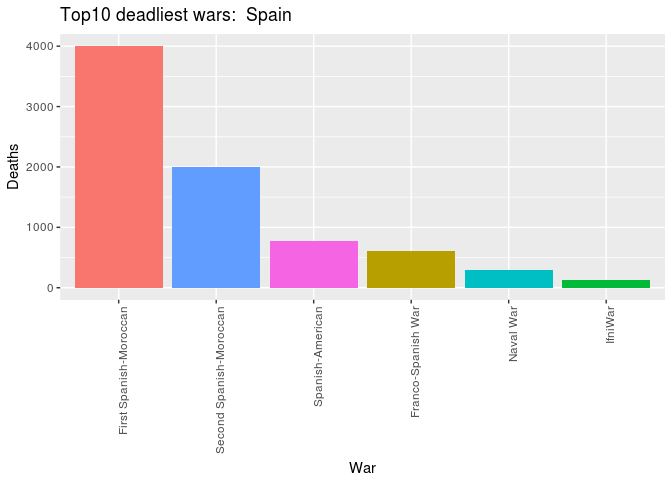
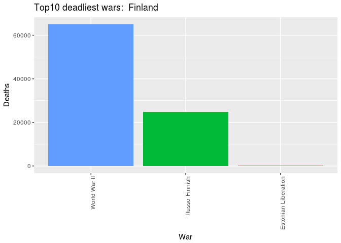

War Dataset
================

Dataset
-------

I found this war dataset from the internet and decide to try some data visualization stuff with R. The dataset is called "Inter-StateWarData\_v4.0.csv" and it can be downloaded from: <http://www.correlatesofwar.org/data-sets>

The data
--------

The first thing to do when doing any kind of data analysis is to take a look at the dataset: You can include R code in the document as follows:

``` r
library(ggplot2)
library(dplyr)
```

    ## 
    ## Attaching package: 'dplyr'

    ## The following objects are masked from 'package:stats':
    ## 
    ##     filter, lag

    ## The following objects are masked from 'package:base':
    ## 
    ##     intersect, setdiff, setequal, union

``` r
library(tidyr)

war <- read.csv("/home/pekka/Downloads/Inter-StateWarData_v4.0.csv", stringsAsFactors = FALSE)
head(war)
```

    ##   WarNum             WarName WarType ccode                StateName Side
    ## 1      1  Franco-Spanish War       1   230                    Spain    2
    ## 2      1  Franco-Spanish War       1   220                   France    1
    ## 3      4 First Russo-Turkish       1   640           Ottoman Empire    2
    ## 4      4 First Russo-Turkish       1   365                   Russia    1
    ## 5      7    Mexican-American       1    70                   Mexico    2
    ## 6      7    Mexican-American       1     2 United States of America    1
    ##   StartMonth1 StartDay1 StartYear1 EndMonth1 EndDay1 EndYear1 StartMonth2
    ## 1           4         7       1823        11      13     1823          -8
    ## 2           4         7       1823        11      13     1823          -8
    ## 3           4        26       1828         9      14     1829          -8
    ## 4           4        26       1828         9      14     1829          -8
    ## 5           4        25       1846         9      14     1847          -8
    ## 6           4        25       1846         9      14     1847          -8
    ##   StartDay2 StartYear2 EndMonth2 EndDay2 EndYear2 TransFrom WhereFought
    ## 1        -8         -8        -8      -8       -8       503           2
    ## 2        -8         -8        -8      -8       -8       503           2
    ## 3        -8         -8        -8      -8       -8       506          11
    ## 4        -8         -8        -8      -8       -8       506          11
    ## 5        -8         -8        -8      -8       -8        -8           1
    ## 6        -8         -8        -8      -8       -8        -8           1
    ##   Initiator Outcome TransTo BatDeath Version
    ## 1         2       2      -8      600       4
    ## 2         1       1      -8      400       4
    ## 3         2       2      -8    80000       4
    ## 4         1       1      -8    50000       4
    ## 5         2       2      -8     6000       4
    ## 6         1       1      -8    13283       4

Looks interesting! First thing that comes to my mind is to check which countries have fought the most wars:

``` r
war %>% group_by(StateName) %>%
            summarise(n = n()) %>%
            arrange(desc(n))
```

    ## # A tibble: 105 x 2
    ##    StateName                    n
    ##    <chr>                    <int>
    ##  1 France                      19
    ##  2 United Kingdom              13
    ##  3 United States of America    13
    ##  4 China                       12
    ##  5 Turkey                      12
    ##  6 Italy                       10
    ##  7 Russia                      10
    ##  8 Japan                        9
    ##  9 Germany                      8
    ## 10 Egypt                        7
    ## # ... with 95 more rows

It looks like France, UK and United States are the top3 countries in the number of wars they have fought. The dataset contains also information about the deaths that countries have suffered in each war. Let's take a look which wars have been the deadliest:

``` r
deadliestwars <- war %>%
                group_by(WarName) %>%
                summarise(summeddeaths = sum(BatDeath)/1000000) %>%
                arrange(desc(summeddeaths)) %>%
                slice(1:10)

ggplot(deadliestwars, aes(x = reorder(WarName, -summeddeaths), y  = summeddeaths, fill = WarName))+
  geom_bar(stat="identity") +
  labs(x = "War", y = "Deaths in Millions", title = "Deaths in the 10 most deadly wars in history") +
  theme(axis.text.x = element_text(angle = 90, hjust = 1)) +
  theme(legend.position="none")
```



No surprise here! WW2 was brutal and WW1 caused a lot of deaths too compared to other wars.

Maybe it would be interesting to see same kind of plot for specific countries. I decided to write a function which can be used to do this kind of barplot for any country:

``` r
top10_wars_function <- function(state){
                        war %>% filter(StateName == state) %>%
                        group_by(WarName) %>%
                        summarise(summeddeaths = sum(BatDeath)) %>%
                        arrange(desc(summeddeaths)) %>%
                        slice(1:10) %>%

ggplot(aes(x = reorder(WarName, -summeddeaths), y  = summeddeaths, fill = WarName))+
  geom_bar(stat="identity") +
  labs(x = "War", y = "Deaths", title = paste("Top10 deadliest wars: ", state)) +
  theme(axis.text.x = element_text(angle = 90, hjust = 1)) +
  theme(legend.position="none")
  
}
```

Now it's easy to select a country and plot the top10 wars.

Let's first take a look at the countries included in the data:

``` r
sort(unique(war$StateName))
```

    ##   [1] "Afghanistan"                      "Angola"                          
    ##   [3] "Argentina"                        "Armenia"                         
    ##   [5] "Australia"                        "Austria"                         
    ##   [7] "Austria-Hungary"                  "Azerbaijan"                      
    ##   [9] "Baden"                            "Bavaria"                         
    ##  [11] "Belgium"                          "Bolivia"                         
    ##  [13] "Bosnia"                           "Brazil"                          
    ##  [15] "Bulgaria"                         "Cambodia"                        
    ##  [17] "Canada"                           "Chad"                            
    ##  [19] "Chile"                            "China"                           
    ##  [21] "China (PRC)"                      "Colombia"                        
    ##  [23] "Croatia"                          "Cuba"                            
    ##  [25] "Cyprus"                           "Czechoslovakia"                  
    ##  [27] "Democratic Republic of the Congo" "Denmark"                         
    ##  [29] "Ecuador"                          "Egypt"                           
    ##  [31] "El Salvador"                      "Eritrea"                         
    ##  [33] "Estonia"                          "Ethiopia"                        
    ##  [35] "Finland"                          "France"                          
    ##  [37] "Germany"                          "Greece"                          
    ##  [39] "Guatemala"                        "Hanover"                         
    ##  [41] "Hesse Electoral"                  "Hesse Grand Ducal"               
    ##  [43] "Honduras"                         "Hungary"                         
    ##  [45] "India"                            "Iran"                            
    ##  [47] "Iraq"                             "Israel"                          
    ##  [49] "Italy"                            "Japan"                           
    ##  [51] "Jordan"                           "Kuwait"                          
    ##  [53] "Laos"                             "Latvia"                          
    ##  [55] "Lebanon"                          "Libya"                           
    ##  [57] "Lithuania"                        "Mecklenburg Schwerin"            
    ##  [59] "Mexico"                           "Modena"                          
    ##  [61] "Mongolia"                         "Morocco"                         
    ##  [63] "Netherlands"                      "New Zealand"                     
    ##  [65] "Nicaragua"                        "North Korea"                     
    ##  [67] "Norway"                           "Oman"                            
    ##  [69] "Ottoman Empire"                   "Pakistan"                        
    ##  [71] "Papal States"                     "Paraguay"                        
    ##  [73] "Peru"                             "Philippines"                     
    ##  [75] "Poland"                           "Portugal"                        
    ##  [77] "Prussia"                          "Qatar"                           
    ##  [79] "Romania"                          "Russia"                          
    ##  [81] "Sardinia/Piedmont"                "Saudi Arabia"                    
    ##  [83] "Saxony"                           "Somalia"                         
    ##  [85] "South Africa"                     "South Korea"                     
    ##  [87] "South Vietnam"                    "Spain"                           
    ##  [89] "Syria"                            "Taiwan"                          
    ##  [91] "Taiwan (ROC)"                     "Tanzania"                        
    ##  [93] "Thailand"                         "Turkey"                          
    ##  [95] "Tuscany"                          "Two Sicilies"                    
    ##  [97] "Uganda"                           "United Arab Emirates"            
    ##  [99] "United Kingdom"                   "United States of America"        
    ## [101] "USSR"                             "Vietnam"                         
    ## [103] "Wuerttemburg"                     "Yemen Arab Republic"             
    ## [105] "Yugoslavia"

Now let's call the function:

``` r
top10_wars_function("United Kingdom")
```



``` r
top10_wars_function("United States of America")
```



``` r
top10_wars_function("France")
```



``` r
top10_wars_function("China")
```



``` r
top10_wars_function("Spain")
```



``` r
top10_wars_function("Finland")
```


